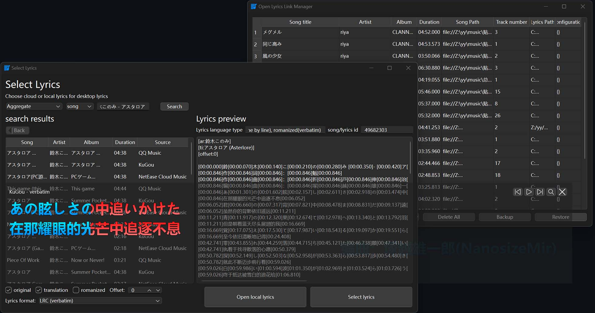
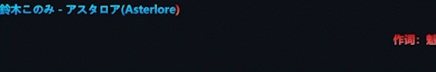

# foo_lddc

[中文](./README.md) | English

A desktop lyrics plugin for foobar2000 that acts as a client for the [LDDC](https://github.com/chenmozhijin/LDDC) main program (requires [LDDC](https://github.com/chenmozhijin/LDDC) to be used together).

## Preview

## Installation

1. Download the latest `foo_lddc_vx.x.x.fb2k-component` from the [Releases](https://github.com/chenmozhijin/foo_lddc/releases) page.
2. If foobar2000 is already associated with fb2k-component files, simply double-click to open it (see the [foobar2000 official tutorial](https://wiki.hydrogenaud.io/index.php?title=Foobar2000:How_to_install_a_component)).

## Notes

1. This plugin requires the [LDDC](https://github.com/chenmozhijin/LDDC) main program. Please download and run the LDDC main program at least once (version 0.7.0 or higher).
2. If you move the LDDC main program, please run it at least once after moving it.
